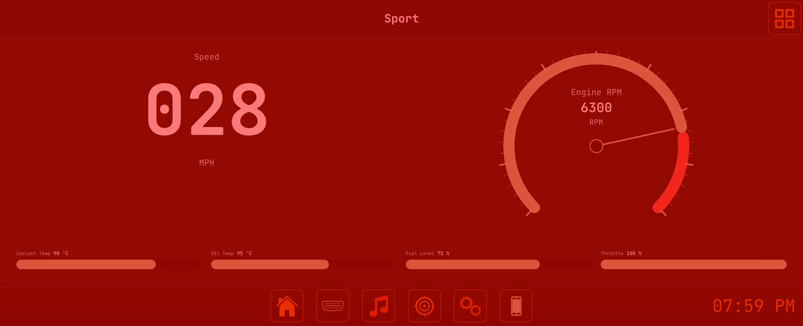

<div align="center">

# OCTAVE

### An open-source car head unit
**Runs on Raspberry Pi, desktop, and Android. C++ or Python backend, QML frontend, MIT.**


<sub>Recorded on the head unit in my Jeep TJ, an Orange Pi 5 driving a 2560x1080 dash display. Every clip and screenshot in this README was captured from the running app. The theme is following the album art.</sub>

[](https://github.com/WayBetterSolutions/OCTAVE/releases/latest)
[](https://github.com/WayBetterSolutions/OCTAVE/stargazers)
[](https://github.com/WayBetterSolutions/OCTAVE/releases)
[](LICENSE)

[](#install)
[](#two-backends-one-frontend)
[](#)

### [Download Latest Release →](https://github.com/WayBetterSolutions/OCTAVE/releases/latest)

</div>

---

OCTAVE is an infotainment system you run on your own hardware: a Raspberry Pi behind the dash, a laptop in a project car, or an Android tablet. It plays local music and Spotify, reads live data from the car over OBD-II, mirrors an Android phone over USB, and recolours its interface to match the album art.

It sits in the same space as Crankshaft, OpenAuto Pro and AGL, but it runs on its own rather than projecting a phone, and it is built to be modified. Most of the customisation (themes, dashboards, layouts, hardware bindings) happens inside the app. Past that, the code is small enough to fork, and it ships in both C++/Qt and Python/PySide6 so you can work in whichever you already know.

I daily-drive it in a 2003 Jeep TJ. That is where most of the design decisions come from, and it is why the README is full of the Jeep.

---

## What it looks like

Every clip below was recorded on the Jeep's head unit with music playing. Each has a different song behind it, and with the **Album Art Capture** theme on, the whole interface takes its colours from the current track.

### Music that colours the whole interface

<p align="center">
  
</p>

Skip a track and the UI recolours. Local MP3, M4A and FLAC with a live waveform, Spotify, and a downloader that pairs Spotify metadata with YouTube audio.

<p align="center">
  
  
</p>

### Gauges and dashboards you build yourself

<p align="center">
  
</p>

Fifty-plus OBD-II parameters, seven gauge primitives (circular, arc, bar, linear, digital, sparkline, warning light), and full-screen dashboards defined in JSON or built in the in-app drag-and-drop editor. The chooser shows every dashboard as a live miniature. "TJ Wrangler 4.0" is the one I actually drive with.

<p align="center">
  
  
</p>
<p align="center">
  
  
</p>

### The shift light

<p align="center">
  
</p>

Set an RPM threshold and the whole screen strobes red when the engine crosses it, whatever page is showing.

<p align="center">
  
</p>

### Your phone on the dash

<p align="center">
  
</p>

Plug in an Android phone and OCTAVE mirrors a DeX-style desktop onto the head unit through a built-in scrcpy-protocol client. There is nothing to install on the phone. Its own screen stays dark in the cradle, an accidental power press is reverted, unlocking the phone hands control back to it, and a brief USB disconnect resumes where you were instead of resetting to the home screen.

### The vehicle, live

<p align="center">
  
</p>

A rigged model of the Jeep with working doors, hood, tailgate, lights, steering and wheels. The BerryIMU on the dash rolls and pitches it in real time, and supplies heading, altitude and cabin temperature.

<p align="center">
  
  
</p>

### The whole thing, page by page

<p align="center">
  
</p>

<p align="center">
  
  
  
</p>

<p align="center">
  
</p>

## How it compares

| | OCTAVE | Crankshaft | OpenAuto Pro | Stock Android Auto |
|---|---|---|---|---|
| Open source | yes (MIT) | yes | partial | no |
| Runs without a phone | yes | no (AA projection) | no (AA projection) | no |
| Built-in OBD-II + custom gauges | yes | no | limited | no |
| Phone mirroring | yes (built-in, nothing to install) | AA only | AA only | n/a |
| Themable / forkable UI | fully (QML) | limited | limited | no |
| Local music + Spotify + downloads | yes | via phone | via phone | via phone |
| Desktop dev loop | yes (Win/macOS/Linux) | Pi only | Pi only | n/a |

## Features

### Media & Audio
- Local player for MP3, M4A, FLAC with album art carousel and live FFT visualizer
- Spotify integration with OAuth2 and full device control
- Music search and download (Spotify metadata + YouTube audio)
- Dynamic theming that pulls colors straight from album art

### Vehicle & Hardware
- OBD-II diagnostics over ELM327 (serial, Bluetooth, BLE on Android) — 50+ live parameters, custom gauges, full dashboards, DTC read and clear
- Phone mirroring over USB with a built-in scrcpy-protocol client and a phone-side keeper that survives locks and cable blips
- ESP32 wireless volume knob with LED sync
- BerryIMU 9DOF sensor fusion (accelerometer, gyro, magnetometer, barometer) with a live vehicle view
- PAJ7620U2 gesture sensor for touchless control

### Platform & Customization
- Runs on Windows, macOS, Linux, Raspberry Pi, and Android
- Two parallel backends (C++ and Python) with the same API surface
- 100+ user-configurable settings, all persisted to disk
- Gauge primitives, JSON dashboards and an in-app dashboard editor — build your own and drop them in
- Rotating logs, crash traces and a Diagnostics page that exports them from the dash

## Install

Pre-built binaries for every platform are on the [Releases](https://github.com/WayBetterSolutions/OCTAVE/releases) page. No toolchain or Python needed:

- **Windows:** `OCTAVE-<version>-windows-x86_64.exe` — run the installer.
- **macOS:** `OCTAVE-<version>-macos.dmg` — open, drag to Applications.
- **Linux:** `OCTAVE-<version>-linux-x86_64.AppImage` — `chmod +x` and run. Works on Ubuntu 22.04+, Debian, Mint, Fedora, openSUSE, and Arch.
  - Arch users may need `fuse2`: `sudo pacman -S fuse2`. Alternative without FUSE: `./OCTAVE-*.AppImage --appimage-extract-and-run`.
- **Android:** `OCTAVE-<version>-android-arm64-v8a.apk` — sideload (the released APK uses a per-build keystore, so updates require uninstalling the previous version).

## Building from source

The Python backend is the quickest way to get a development loop going:

```bash
git clone https://github.com/waybettersolutions/octave.git
cd octave
python setup.py
```

`setup.py` detects your OS, installs dependencies, builds a virtualenv, and launches the app. Pass `--no-run` to install without launching.

After setup:

```bash
source venv/bin/activate            # Windows: venv\Scripts\activate
python main.py                       # normal run
python main.py --debug               # verbose logging
python -m dev.main_dev               # simulated OBD + keyboard controls
```

### C++ build

```bash
cmake -S . -B build -DCMAKE_BUILD_TYPE=Debug
cmake --build build -j
./build/octave
```

Full build matrix (9 targets including iOS, Android, Flatpak, and app store variants) lives in [BUILD.md](BUILD.md).

### YouTube downloads failing

If downloads fail with *"Sign in to confirm you're not a bot"*, the usual cause is a VPN. YouTube blocklists most shared VPN exit IPs, and downloads work again on a residential connection or a dedicated-IP exit node.

If you need to stay on the VPN, you can authenticate with your YouTube account through a cookies file instead:

1. Install the **Get cookies.txt LOCALLY** extension in any Chromium-based browser:
   - Desktop: Chrome / Brave / Edge / Vivaldi.
   - Android: **Kiwi Browser** or **Brave** (Chrome on Android doesn't support extensions).
2. Log into <https://www.youtube.com> in that browser.
3. Click the extension's icon while on a YouTube tab → **Export → cookies.txt**.
4. Save (or rename) the file to `youtube_cookies.txt` in your **Downloads** folder:
   - **Linux / macOS:** `~/Downloads/youtube_cookies.txt`
   - **Windows:** `%USERPROFILE%\Downloads\youtube_cookies.txt`
   - **Android:** `/storage/emulated/0/Download/youtube_cookies.txt` (visible as `Internal storage / Download / youtube_cookies.txt` in any file manager)
5. Restart OCTAVE. Downloads now use those cookies, which usually stay valid for weeks.

OCTAVE picks the file up automatically. There is no setting to configure.

## Two backends, one frontend

OCTAVE has two backends, C++ / Qt 6 in `src/` and Python / PySide6 in `backend/`, that expose the same managers, signals and settings to a single QML frontend. The frontend does not know which one is running.

The C++ tree is what ships: every release binary on every platform, including Android, is built from it. The Python tree is for development and hardware work. On a Pi with a new sensor on the I²C bus, a Python REPL beats a compile cycle, and most managers are a few hundred lines you can read in one sitting.

Both are kept in sync on desktop. A feature or fix in one lands in the other in the same change.

## Dev tooling

The clips and screenshots above are scripted. `python -m dev.main_dev --profile` runs OCTAVE with a simulated engine and a local command server, and `python -m dev.screenshots.stories` drives it through scenes (navigate, play, floor the throttle, switch dashboards), captures the window from inside Qt, and writes WebP, GIF and PNG. The same command channel is exposed as MCP tools, so a coding agent can navigate the app, change settings, read performance counters and record clips. Everything is under `dev/` and documented in the wiki.

## System requirements

- **Python** 3.8+ (for the Python backend) / **Qt 6** + **CMake 3.16+** (for C++)
- **OS:** Windows 10+, macOS 10.14+, Linux (Debian / Arch / Fedora), Raspberry Pi OS, Android

## Roadmap

Larger items in progress. Full plans are under [`TODO/`](TODO/).

- **Android on the Play Store.** The C++ port runs on sideload today. See [`TODO/android-cpp-port.md`](TODO/android-cpp-port.md).
- **Companion app** for phone mirroring without USB debugging. See [`TODO/octave-companion-app.md`](TODO/octave-companion-app.md).
- **CarlinKit wireless CarPlay / Android Auto dongle support.** See [`TODO/carlinkit-dongle-port.md`](TODO/carlinkit-dongle-port.md).
- **In-app error notifications**, so backend problems show up on screen rather than only in the logs.
- **More tests** beyond the current smoke suite.

## Documentation

The wiki covers architecture, every backend manager, every frontend page, the settings reference, hardware setup and the build guides. Start at [`wiki/index.html`](wiki/index.html). For gauges and dashboards, [`docs/GAUGE_AUTHORING.md`](docs/GAUGE_AUTHORING.md) is the spec.

## Star history

<a href="https://star-history.com/#WayBetterSolutions/OCTAVE&Date">
  
</a>

## Contributing

Pull requests and bug reports are welcome. If you build a dashboard, a sensor integration or a port to new hardware, open an issue or PR. I would like to see it.

## License

2026 [Way Better Solutions](https://waybetter.solutions/). MIT License.
