<div align="center">

# OCTAVE

### Open-source car infotainment · carputer · DIY head unit
**Raspberry Pi · Desktop · Android — fully programmable, hackable, MIT-licensed.**

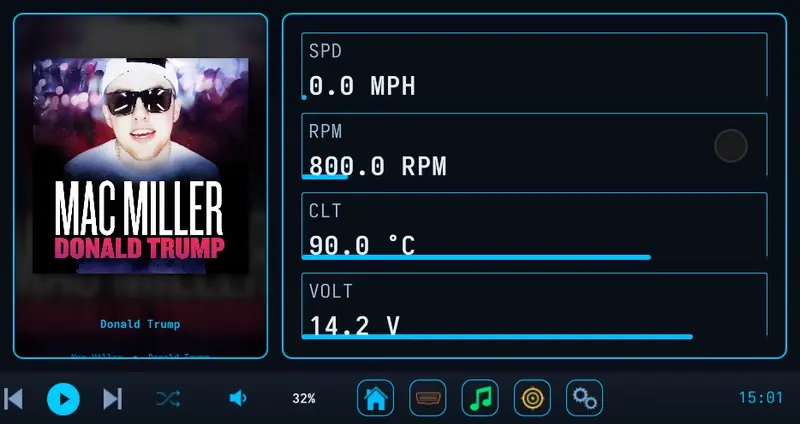

<sub>Recorded on the head unit in the author's Jeep TJ, an Orange Pi 5 driving a 2560x1080 dash display. Every clip and screenshot in this README was captured from the running app; the theme is following the album art.</sub>

[](https://github.com/WayBetterSolutions/OCTAVE/releases/latest)
[](https://github.com/WayBetterSolutions/OCTAVE/stargazers)
[](https://github.com/WayBetterSolutions/OCTAVE/releases)
[](LICENSE)

[](#get-octave)
[](#two-backends-one-frontend)
[](#)
[](https://github.com/WayBetterSolutions/OCTAVE/pulse)
[](https://github.com/WayBetterSolutions/OCTAVE/network/members)

### [Download Latest Release →](https://github.com/WayBetterSolutions/OCTAVE/releases/latest)

</div>

---

OCTAVE is an open-source infotainment system. A carputer you actually own. Rip out your factory head unit and bolt a Raspberry Pi to your dash, run it on a laptop in a project car, or sideload it onto an Android tablet. It plays your music, talks to your car over OBD-II, mirrors your phone, and themes itself to your album art.

If you've poked at **Crankshaft, OpenAuto Pro, or AGL** before, OCTAVE lives in the same neighborhood — closer to a hackable foundation than a polished product. Two backends ship side by side, C++/Qt and Python/PySide6, so you can fork whichever one you're already fluent in.

---

## Why OCTAVE

Stock head units age out fast. Aftermarket units lock you in. Android Auto and CarPlay are great until you want to do something the manufacturer didn't sign off on.

OCTAVE is the third option: a stack you build, modify, and run on whatever hardware you want. If you've ever wanted to wire a rotary encoder to your dash, throw a custom OBD gauge on screen, or theme your UI to match your album art in real time, this is the project for you.

It's not really a product. It's more like vanilla Minecraft — I'll keep the base build healthy and supported, but the amount of customization baked in means no two OCTAVE installs are going to look the same. Themes, dashboards, layouts, hardware bindings, gauges, sensors, the lot. And if you want to go further than the built-in knobs allow, the whole thing is yours to fork.

## See It

Everything below was shot on the real rig with the music playing. Each clip has a different song behind it, and since the **Album Art Capture** theme is on, the whole interface takes its colours from whatever is playing.

### Music that colours the whole interface

<p align="center">
  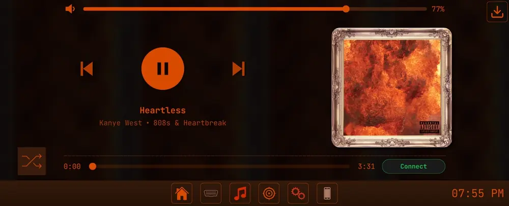
</p>

Skip a track and the UI recolours. Local MP3/M4A/FLAC with a live waveform, Spotify, and a built-in downloader that pairs Spotify metadata with YouTube audio.

<p align="center">
  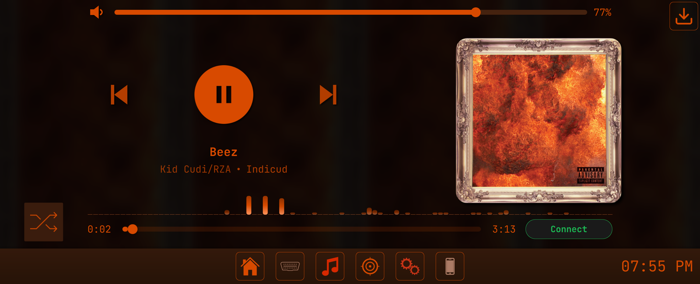
  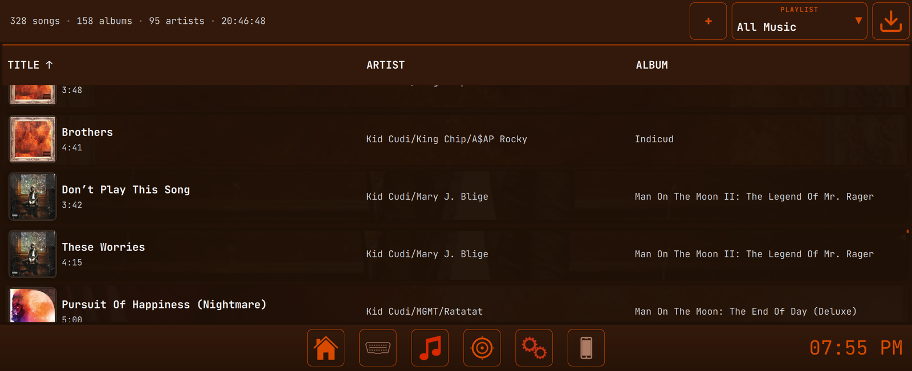
</p>

### Gauges and dashboards you build yourself

<p align="center">
  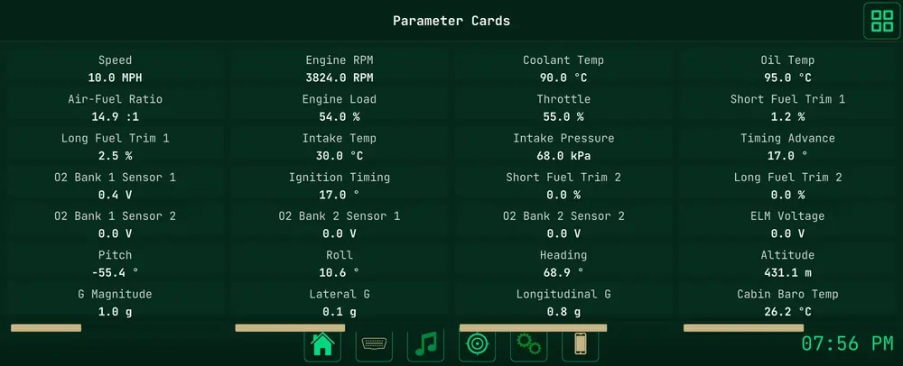
</p>

Fifty-plus OBD-II parameters, a set of gauge primitives (circular, arc, bar, linear, digital, sparkline, warning light), and full-screen dashboards defined in JSON or built in the in-app drag-and-drop editor. The chooser shows every dashboard as a live miniature. The "TJ Wrangler 4.0" one is the author's daily layout.

<p align="center">
  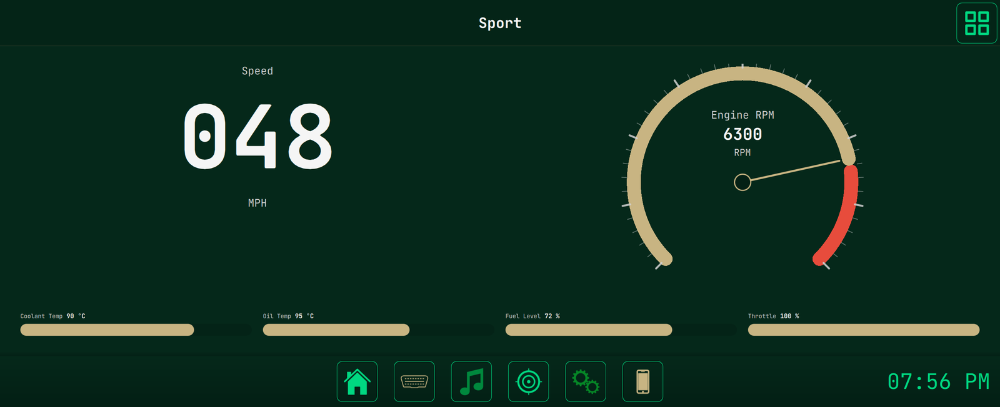
  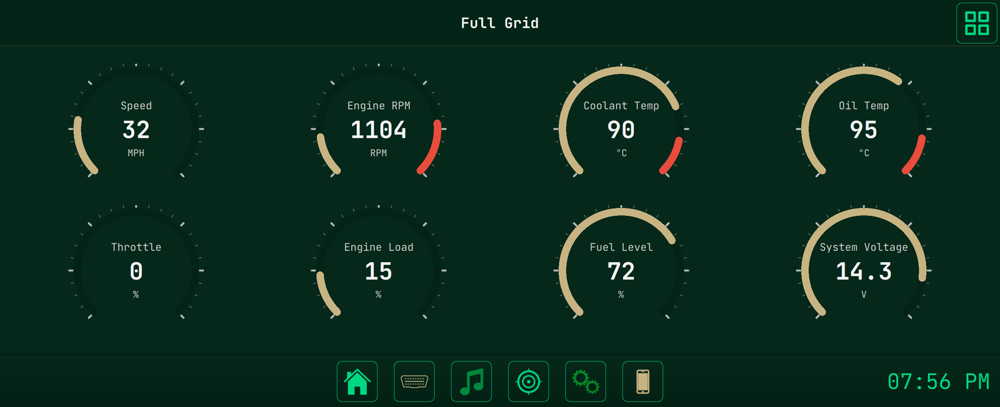
</p>
<p align="center">
  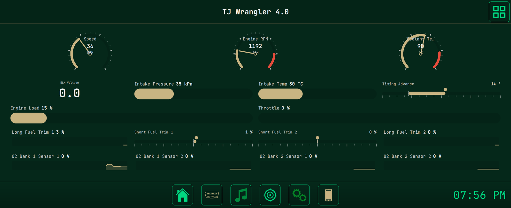
  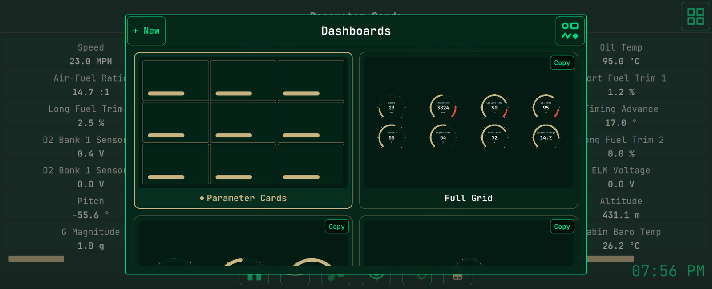
</p>

### The shift light

<p align="center">
  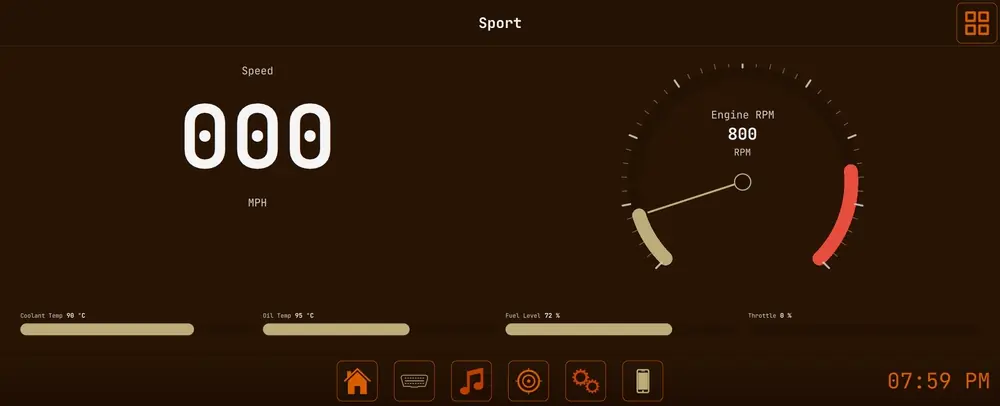
</p>

Set an RPM flag and the entire screen strobes when the engine crosses it, whatever page is showing. It is the one thing in OCTAVE built to be impossible to miss, so it gets its own clip and appears nowhere else on this page.

### Your phone on the dash

<p align="center">
  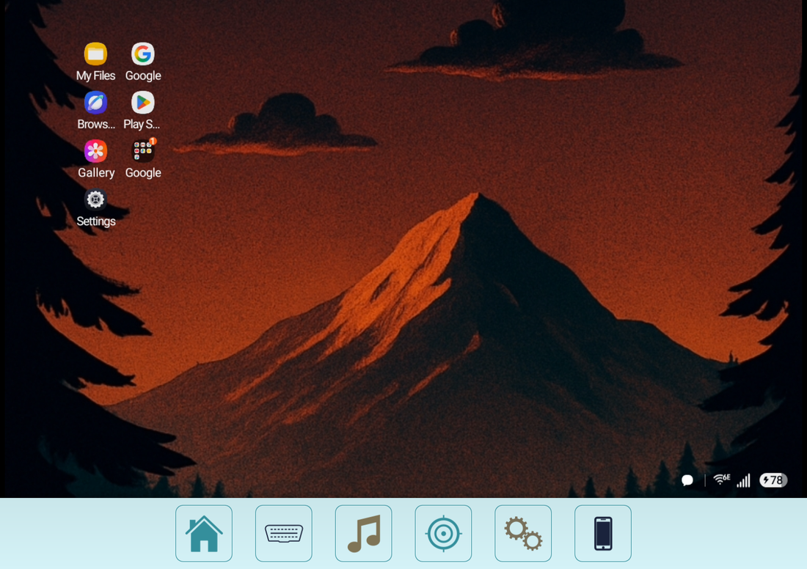
</p>

Plug in an Android phone and OCTAVE mirrors a DeX-style desktop onto the head unit through a built-in scrcpy-protocol client. Nothing to install on the phone, no companion app. The phone's own screen stays dark in the cradle, a power press is undone before you notice, unlocking the phone hands it back to you, and a USB blip keeps whatever you had open instead of resetting to the home screen.

### The vehicle, live

<p align="center">
  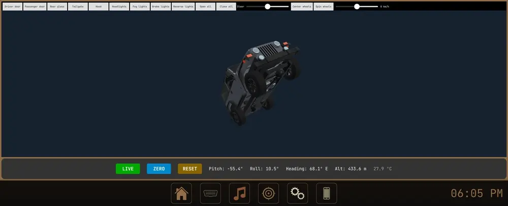
</p>

A rigged model of the Jeep with working doors, hood, tailgate, lights, steering and wheels, rolled and pitched in real time by the BerryIMU on the dash. (The bench it was shot on is not level, hence the angle.) Heading, altitude and cabin temperature come from the same sensor.

<p align="center">
  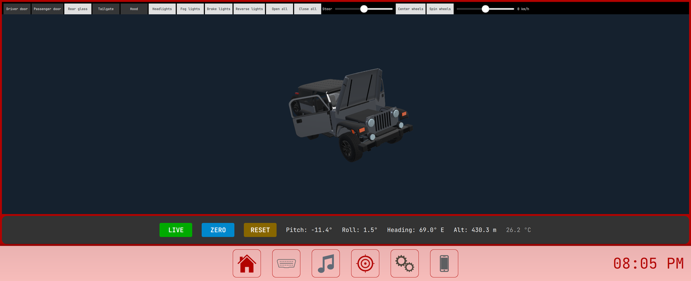
  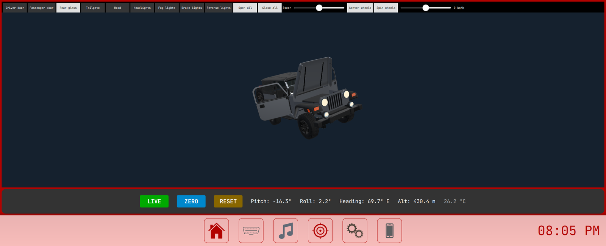
</p>

### The whole thing, page by page

<p align="center">
  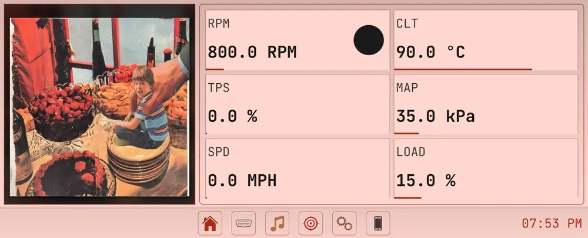
</p>

<p align="center">
  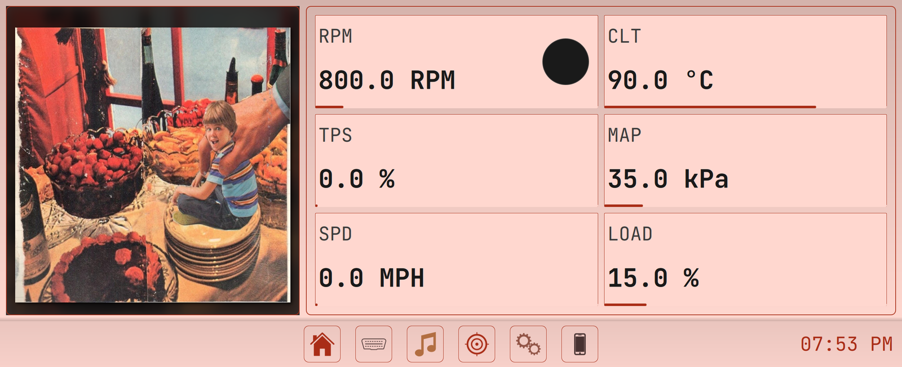
  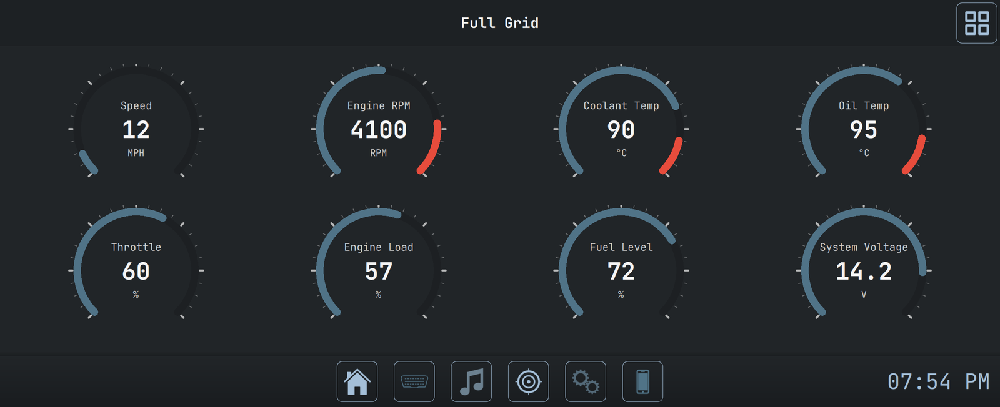
  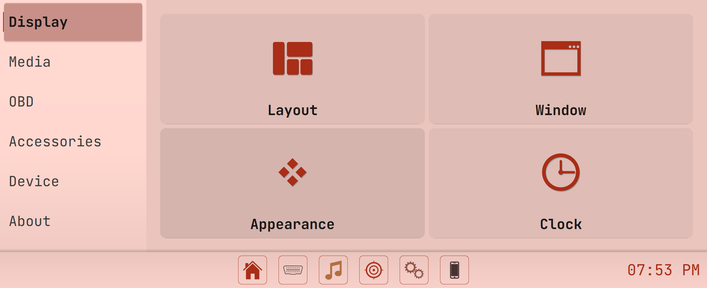
</p>

<p align="center">
  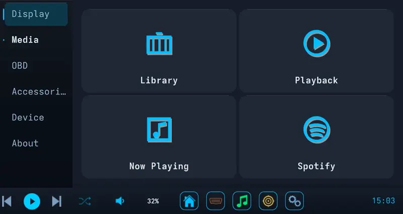
</p>

## Who This Is For

- **The Pi tinkerer.** You've got a Raspberry Pi 4 or 5, a touchscreen, and a free weekend. You want a real infotainment stack to hack on, not a kiosk wrapped around a browser tab.
- **The factory-head-unit refugee.** Your 2008 Civic / E46 / Tacoma / van came with something terrible (or nothing at all), and you'd rather wire a tablet into the dash than drop $900 on a double-DIN.
- **The Android Auto / CarPlay defector.** Those are fine until you want to do something the manufacturer didn't sign off on. OCTAVE is the "do whatever you want" option.
- **The OBD-II data nerd.** You want live gauges, custom dashboards, and 50+ PIDs on screen without paying a subscription.
- **The van-build / overlander / project-car person.** You need an interface that survives being rebuilt three times and fits hardware nobody else supports.

## How It Compares

| | OCTAVE | Crankshaft | OpenAuto Pro | Stock Android Auto |
|---|---|---|---|---|
| Open source | yes (MIT) | yes | partial | no |
| Runs without a phone | yes | no (AA projection) | no (AA projection) | no |
| Built-in OBD-II + custom gauges | yes | no | limited | no |
| Phone mirroring | yes (built-in, nothing to install) | AA only | AA only | n/a |
| Themable / forkable UI | fully (QML) | limited | limited | no |
| Local music + Spotify + downloads | yes | via phone | via phone | via phone |
| Desktop dev loop | yes (Win/macOS/Linux) | Pi only | Pi only | n/a |

If you want a head unit that runs **on its own** instead of a screen that mirrors your phone, OCTAVE is the one.

## What's In The Box

### Media & Audio
- Local player for MP3, M4A, FLAC with album art carousel and live FFT visualizer
- Spotify integration with OAuth2 and full device control
- Music search and download (Spotify metadata + YouTube audio)
- Dynamic theming that pulls colors straight from album art

### Vehicle & Hardware
- OBD-II diagnostics over ELM327 (serial, Bluetooth, BLE on Android) — 50+ live parameters, custom gauges, full dashboards, DTC read and clear
- Phone mirroring over USB with a built-in scrcpy-protocol client and a phone-side keeper that survives locks and cable blips
- ESP32 wireless volume knob with LED sync
- BerryIMU 9DOF sensor fusion (accelerometer, gyro, magnetometer, barometer) with a live vehicle view
- PAJ7620U2 gesture sensor for touchless control

### Platform & Customization
- Runs on Windows, macOS, Linux, Raspberry Pi, and Android
- Two parallel backends so you can hack in whichever language you'd rather live in
- 100+ user-configurable settings, all persisted to disk
- Gauge primitives, JSON dashboards and an in-app dashboard editor — build your own and drop them in
- Rotating logs, crash traces and a Diagnostics page that exports them from the dash, so a failure on the road is never a mystery

## Get OCTAVE

The fastest way to try OCTAVE is to grab the pre-built binary for your OS from the [Releases](https://github.com/WayBetterSolutions/OCTAVE/releases) page and give it a spin — no toolchain, no build, no Python venv. One installer per platform:

- **Windows:** `OCTAVE-<version>-windows-x86_64.exe` — run the installer.
- **macOS:** `OCTAVE-<version>-macos.dmg` — open, drag to Applications.
- **Linux:** `OCTAVE-<version>-linux-x86_64.AppImage` — `chmod +x` and run. Works on Ubuntu 22.04+, Debian, Mint, Fedora, openSUSE, and Arch.
  - Arch users may need `fuse2`: `sudo pacman -S fuse2`. Alternative without FUSE: `./OCTAVE-*.AppImage --appimage-extract-and-run`.
- **Android:** `OCTAVE-<version>-android-arm64-v8a.apk` — sideload (the released APK uses a per-build keystore, so updates require uninstalling the previous version).

If you'd rather build it yourself, hack on the code, or run from a checkout, keep reading.

## Building from source

If you just want to run the app, use the pre-built download above. Building from source is for hacking on OCTAVE — the Python backend is the fastest dev loop:

```bash
git clone https://github.com/waybettersolutions/octave.git
cd octave
python setup.py
```

`setup.py` detects your OS, installs dependencies, builds a virtualenv, and launches the app. Pass `--no-run` to install without launching.

After setup:

```bash
source venv/bin/activate            # Windows: venv\Scripts\activate
python main.py                       # normal run
python main.py --debug               # verbose logging
python -m dev.main_dev               # simulated OBD + keyboard controls
```

### Running the C++ Build

```bash
cmake -S . -B build -DCMAKE_BUILD_TYPE=Debug
cmake --build build -j
./build/octave
```

Full build matrix (9 targets including iOS, Android, Flatpak, and app store variants) lives in [BUILD.md](BUILD.md).

### YouTube downloads failing? Check your VPN first.

**99% of the time the fix is to turn off your VPN.** YouTube's bot detection blocklists most VPN exit IPs (NordVPN, ExpressVPN, Mullvad, ProtonVPN, etc. — they're shared with thousands of automated tools), and every download will fail with *"Sign in to confirm you're not a bot"* until you reconnect on a residential IP. If you need to stay on a VPN, switch to a residential-IP plan or a dedicated-IP exit node.

If turning off the VPN isn't an option (geo-restricted regions, privacy requirements), you can authenticate with your YouTube account via cookies as a fallback:

1. Install the **Get cookies.txt LOCALLY** extension in any Chromium-based browser:
   - Desktop: Chrome / Brave / Edge / Vivaldi.
   - Android: **Kiwi Browser** or **Brave** (Chrome on Android doesn't support extensions).
2. Log into <https://www.youtube.com> in that browser.
3. Click the extension's icon while on a YouTube tab → **Export → cookies.txt**.
4. Save (or rename) the file to `youtube_cookies.txt` in your **Downloads** folder:
   - **Linux / macOS:** `~/Downloads/youtube_cookies.txt`
   - **Windows:** `%USERPROFILE%\Downloads\youtube_cookies.txt`
   - **Android:** `/storage/emulated/0/Download/youtube_cookies.txt` (visible as `Internal storage / Download / youtube_cookies.txt` in any file manager)
5. Restart OCTAVE — every download will now use those cookies. Cookies usually stay valid for weeks.

OCTAVE detects the file automatically — no settings to configure. If you don't have the file, downloads still work for any video that isn't currently walled by YouTube on your network.

## Two backends, one frontend

This is the part I care about most.

OCTAVE ships **two parallel backends**, C++ / Qt 6 and Python / PySide6, both driving the same QML frontend. Not because the project needs both, but because **you** might. The whole reason it exists in two languages is so the next person to fork OCTAVE can pick up the side they already speak and start building.

- Love C++? `src/` is yours. Performance, app stores, mobile — that's the side that ships natively.
- Live in Python? `backend/` is yours. Want to wire up a weird sensor on a Pi at 2am with a REPL open? Done in 20 lines.

The frontend doesn't know or care which one is running. Mod whichever side you want, ship to whoever you want.

You don't have to fork to make OCTAVE yours — most of the customization is just settings, themes, and dashboards you build inside the app. But if you do want to fork and ship something I'd never have thought of, the wild rigs and weird hardware ports are the part I'm most excited to see.

## Dev tooling

The screenshots and clips above were not staged by hand. `python -m dev.main_dev --profile` runs OCTAVE with a simulated engine and a local command server; `python -m dev.screenshots.stories` then drives it through scripted scenes (navigate, play, floor the throttle, switch dashboards), records the window straight from Qt, and writes README-ready WebP, GIF and PNG. The same channel is exposed as MCP tools, so an AI coding agent can navigate the app, poke settings, read performance counters and record clips while it works. It all lives under `dev/` and is documented in the wiki.

## System Requirements

- **Python** 3.8+ (for the Python backend) / **Qt 6** + **CMake 3.16+** (for C++)
- **OS:** Windows 10+, macOS 10.14+, Linux (Debian / Arch / Fedora), Raspberry Pi OS, Android

## Roadmap

A few of the bigger things in flight — full plans live under [`TODO/`](TODO/):

- **Native C++ Android port, sideload polish** — on the way to Play Store distribution. See [`TODO/android-cpp-port.md`](TODO/android-cpp-port.md).
- **Companion app** for phone mirroring without USB debugging. See [`TODO/octave-companion-app.md`](TODO/octave-companion-app.md).
- **CarlinKit / wireless CarPlay-Android Auto dongle support.** See [`TODO/carlinkit-dongle-port.md`](TODO/carlinkit-dongle-port.md).
- **In-app error notification UI** — surface backend issues without diving into log files.
- **Expanded test coverage** — beyond the current smoke suite.

## Documentation

The wiki covers everything — architecture, every backend manager, every frontend page, settings reference, hardware setup, build guides, the gauge authoring spec — start at [`wiki/index.html`](wiki/index.html). For building gauges and dashboards specifically, [`docs/GAUGE_AUTHORING.md`](docs/GAUGE_AUTHORING.md) is the source of truth.

## Star History

<a href="https://star-history.com/#WayBetterSolutions/OCTAVE&Date">
  
</a>

## Contributing

Pull requests welcome. Bug reports welcome. Hardware mods extremely welcome.

If you build something cool on top of OCTAVE — a custom dashboard, a new sensor integration, a port to weirder hardware — open an issue or PR and show it off. The more wild builds out there, the better the project gets.

Star the repo if you want to follow along.

## License

2026 [Way Better Solutions](https://waybetter.solutions/) — MIT License. Do whatever you want with it.
