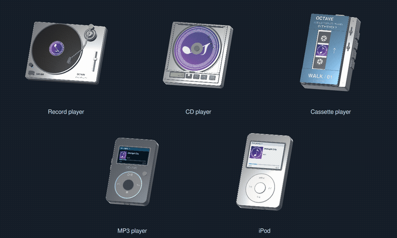

# Music player objects

Select **Settings → Media → Now Playing → Music Player Object** (also available in the immersive Now Playing editor). Choices are Album art, Record player, MP3 player, CD player, Cassette player, and iPod. Album art is the default. Drag a model to change its viewing angle; double-click/tap to restore the view.



[Full-size animation video](images/music-player-loading.mp4)

## Photo references

Researched September 12, 2026, before modeling. These are original OCTAVE-branded interpretations of the references, not dimensionally exact product replicas. Reference photographs are not redistributed or used as model textures.

| Model | Reference photographs | Design cues |
| --- | --- | --- |
| Record player | [Technics SL-1200GR product gallery](https://us.technics.com/products/direct-drive-turntable-system-sl-1200gr) | Silver plinth, black platter, strobe rim, S-shaped arm, cartridge, pitch fader, isolation feet. |
| Cassette player | [Sony TPS-L2, Victoria and Albert Museum](https://collections.vam.ac.uk/item/O1328406/stowaway-tps-l2-audiocassette-player-sony-corporation/) | Blue-and-silver case, vertical tape window, twin spools, orange top control, side transport keys. |
| CD player | [Sony D-50 photo gallery](https://hifivintage.eu/en/DISCMAN/6310-sony-d-50.html), [Sony's D-50 history](https://www.sony.com/en/SonyInfo/CorporateInfo/History/SonyHistory/2-07.html) | Square portable enclosure, circular disc well, top lid, small LCD and physical transport keys. The hinged lid opens during disc exchanges. |
| MP3 player | [SanDisk Sansa Clip photograph](https://www.ecrater.com/p/4342725/sandisk-1gb-sansa-clip-mp3) | Small dark shell, blue control ring, monochrome-style display, home button, rear clip. |
| iPod | [Silver iPod classic gallery](https://iosys.co.jp/items/audio/player/ipod_classic_mc293j_a/48912) | Rounded alloy face, polished rear shell, white click wheel, inset screen, hold switch and dock connector. |

## Assets and rendering

`frontend/assets/music_devices/` contains five body GLBs, separate record/CD/reel GLBs, pivot-local tonearm, CD lid, cassette door and removable tape assemblies, two alpha masks for the printed album-art surfaces, and a small generated HDR studio environment (256×128, run-length encoded). Materials, textures, decals and geometry are generated locally. GLBs can also be imported into Blender or other glTF editors.

`tools/music_devices/generate.py` is the editable source. It uses Python 3, NumPy, Pillow, and GNU FreeSans fonts. To regenerate:

```bash
python3 tools/music_devices/generate.py
```

Set `OCTAVE_MODEL_FONT` and `OCTAVE_MODEL_FONT_BOLD` to local font paths if FreeSans is elsewhere. These are development-only dependencies; the application loads the checked-in GLBs without Python modeling packages. Static details are batched by material; moving assemblies are loaded separately so doors, media and the tonearm can animate independently.

### Geometry and texture budget

The generator sizes everything for how large a part can appear on screen (about two pixels per model unit in the immersive editor, under one on a 1024×600 head unit), not for close-ups:

- Curves get only as many segments as keep the chord error under 0.2 px (`curve_segments`), so a 113-unit platter uses 76 segments and a 2-unit screw head uses 8.
- Solid cylinders are fan-capped without the degenerate inner wall; corner radii and edge bevels below half a pixel collapse to plain boxes; tube segment counts follow the tube radius.
- The turntable's 200 strobe dots are flat hexagons on the outside of the strobe band, where they are visible, instead of tiny cylinders buried inside the solid chrome rim.
- Every printed label in a part is packed into one texture atlas at save time, so all decals of a part cost one blended draw call and one texture. Text that would sit underneath the album-art surfaces (tape label, vinyl label, CD face) is not baked at all, because the cover always covers it.
- The vinyl groove texture is a 512×512 opaque JPEG with a groove pitch coarse enough to survive mip filtering; the CD's diffraction is one annulus with a 128×128 hue wheel rather than 48 sector meshes and materials.
- Indices are 16-bit; unused materials, textures and images are pruned from each GLB.

Totals for the set: 4.1 MB → 0.74 MB on disk, the record player 29.7k → 5.6k triangles, and the cassette body 20 materials → 6. `tests/test_music_devices_assets.py` parses every GLB and fails a regeneration that exceeds the triangle or file-size budgets, uses 32-bit indices, leaves unreferenced images, or splits decals back into separate materials.

`MusicDeviceScene.qml` uses [Qt Quick 3D RuntimeLoader](https://doc.qt.io/qt-6/qml-qtquick3d-assetutils-runtimeloader.html), physical materials, a studio light probe and 4x MSAA. Screen-space ambient occlusion is off, matching the vehicle view in `CarMenu.qml`; the three-light probe carries the shading and the view is rendered every frame beside the media list while a disc spins. The Quick3D availability probe (`MusicDevicePreference.isAvailable()`) runs on first demand, so the default Album art mode never loads the 3D module at startup. The record rotates at 33⅓ RPM. CD and cassette motion use slower illustrative speeds; they are not physical transport simulations. Both digital screens show live album art alongside track, artist, progress, elapsed time and remaining time. Physical keys are modeled details; playback controls remain in the music menu.

The CD's LCD shows live elapsed playback time and PLAY/PAUSE/LOADING/READY state. Its clear acrylic lid is closed during normal playback and opens for loading; the disc stays visible beneath the pane. The cassette door has a real opening over the removable cassette so its spools remain legible at menu size. Drag horizontally or vertically for unrestricted full rotations. Angles wrap after each full turn to retain precision; double-click/tap restores the default view.

## Integration and validation

`MusicDevicePreference.qml` synchronizes the `musicDeviceModel` setting through the existing generic settings API, shared by C++ and Python. Both backends include the default and reset notification. Unknown values resolve to album art. The scene is loaded only when selected and visible, and unloaded when the menu hides. Playback signals from either local media or Spotify drive the animation timer. Pausing preserves the angle.

Qt Quick 3D remains optional. Its imports are isolated in the lazily loaded scene. The music menu displays the existing album carousel if the module or assets cannot load. The carousel's transition/settled lifecycle is retained because it also schedules track analysis and metadata updates.

Validated with a desktop C++ build, real Qt/OpenGL rendering of all five models, `tests/test_music_devices.py` (asset loading, playback/pause/hidden lifecycle, selection propagation, invalid value fallback, persistence, reset, and integration QML compilation) and `tests/test_music_devices_assets.py` (geometry, texture and file-size budgets). Existing Python boot and smoke tests also pass. Android and Raspberry Pi hardware performance have not been measured.

## Loading animation behavior

Selecting a player or returning to the visible music menu plays a short incoming-media sequence. Track changes from local playback or Spotify run an exchange of about two seconds (2.45 seconds for the CD player): the tonearm parks or the lid/door opens, old media lifts out, replacement media slides in, then the arm lowers or the lid/door closes. The record's spindle and rubber mat remain attached to the deck. MP3/iPod track changes use a brief screen fade inside the stationary housing.

Audio playback and existing track controls are not delayed. Disc/reel rotation pauses during loading, resumes only if playback is active, and remains stopped if the user pauses during the exchange. Rapid skips share the current sequence and retain the latest track metadata. Hiding the view or switching model cancels the old animation and restores the seated pose. The Now Playing transition preview also triggers the device exchange.

`tests/fixtures/MusicDeviceLoadingSmoke.qml` exercises every device, rapid repeated requests, pause during loading, final seated pose, arrival, hiding, and switching models mid-exchange. Visual verification uses actual Qt/OpenGL renders of the moving assemblies.

## Album artwork

All five players use the media room's current album cover. Records carry a circular center label with a spindle hole; CDs have a printed circular disc face with a clear hub, visible through the transparent acrylic lid while spinning. The cassette's square label is visible between the reels through the door window. Both MP3 and iPod displays include a square thumbnail without stretching the cover.

`MusicDeviceArtSurface.qml` provides printed surfaces attached to their moving parent assemblies; the circular record and CD faces use the generated `mask-record.png` / `mask-cd.png` alpha textures as the material's opacity map, so no offscreen `OpacityMask` layers are involved. `MusicDeviceCover.qml` shares aspect-preserving cropping and missing/broken-image fallback with the digital screens. During loading, outgoing physical media retains its previous cover until the incoming half of the exchange. Delayed cover updates and rapid skips resolve to the latest art; digital screens update during their fade.

`MusicDeviceArtworkSmoke.qml` checks cover loading, outgoing/incoming artwork timing, broken and empty cover fallback, recovery on the next valid cover, and digital screen updates. The animated preview above uses OCTAVE's placeholder art to demonstrate placement.

### Clear CD lid

The CD lid and disc well are inset within the chassis edges. The lid has an alloy perimeter and a lightly tinted transparent pane, with no opaque backing or album-art overlay. Its slightly longer loading sequence lets the lid close gently before the motor ramps up over 650 ms. Pausing still stops rotation immediately. [CD-only animation preview](images/cd-player-clear-lid.gif).

### Framing and cassette assembly

The device view now takes 44% of the music row (album art retains its existing 40%). The camera smoothly expands its framing during loading to contain raised discs and opened lids/doors, with rotation-safe margins instead of a fixed crop. Geometry checks sampled 101 loading poses per mechanical player and verified that every part fits inside the camera's framing sphere, independent of viewing angle.

The cassette has connected chamber sidewalls and hinge supports. Side-button ribs, volume controls and reel hubs seat against their supporting parts, and the STEREO marking stays on the door panel instead of extending into the window. The removable tape and its reels still travel together during loading.

## Playback-detail audit

All time readouts consume `MediaRoom.position` and `MediaRoom.duration` in milliseconds, shared by the local and Spotify backends. They use actual playback position rather than an independent animation clock, follow seeking and track resets, clamp invalid/out-of-range values, and support hour-long tracks. Unknown remaining time reads `--:--`.

| Player | Live details |
| --- | --- |
| CD | Elapsed LCD time; PLAY/PAUSE/LOADING/READY status; no fabricated track number; gentle spin-up after lid closure. |
| MP3 | Album cover, track/artist, elapsed/remaining time, seek progress, loading/paused/empty states. |
| iPod | Same live state as MP3, within the larger display and existing album-art layout. |
| Record | Stylus starts on the outer groove and advances inward with track progress; bearing shaft supports its correct playing height; strobe indicator follows playback. |
| Cassette | Tape transfers between reels with progress; reel speeds differ according to the changing tape radii; seeking updates the tape distribution. |

No selected track means READY, zero progress, placeholder artwork and stationary transports. Physical markings (model names, speed selections and cassette capacity) remain printed design details; model buttons remain decorative, with the app's playback controls handling input. No fake battery charge or playlist index is shown.

`MusicDeviceDetailsSmoke.qml` exercises playback/pause, seek, loading, empty state, negative/invalid time, duration overruns, hour formatting, tonearm travel and tape distribution across all five device selections. Actual Qt/OpenGL renders verify the LCD and digital-screen bindings and the mechanical poses. The preview uses a simulated clock to demonstrate these readouts; the app itself uses the backend's clock.
